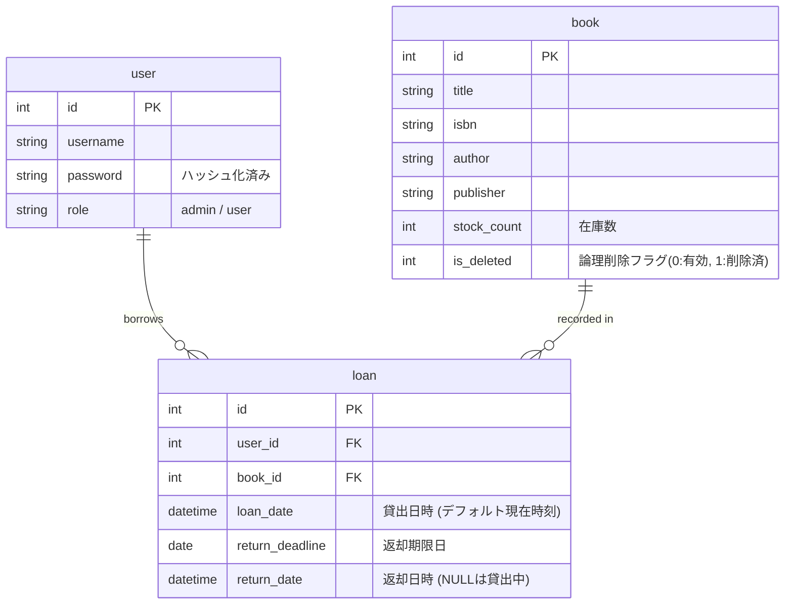

# データベース設計書

本システムは SQLite3 を使用しています。以下にテーブル構造と定義を示します。

## 1. ER図

## 2. テーブル定義詳細

### 2.1. user (ユーザー)
| カラム名 | データ型 | 制約 | 説明 |
|---|---|---|---|
| id | INTEGER | PRIMARY KEY, AUTOINCREMENT | ユーザーID |
| username | TEXT | UNIQUE, NOT NULL | ログインID |
| password | TEXT | NOT NULL | パスワード（Werkzeugによりハッシュ化） |
| role | TEXT | NOT NULL | 権限 (admin:管理者, user:一般) |

### 2.2. book (書籍)
| カラム名 | データ型 | 制約 | 説明 |
|---|---|---|---|
| id | INTEGER | PRIMARY KEY, AUTOINCREMENT | 書籍ID |
| title | TEXT | NOT NULL | 書籍タイトル |
| isbn | TEXT | NOT NULL | ISBNコード |
| author | TEXT | | 著者名 |
| publisher | TEXT | | 出版社 |
| stock_count | INTEGER | DEFAULT 0 | 在庫数（0以上を想定） |
| is_deleted | INTEGER | DEFAULT 0 | 0:有効, 1:論理削除済み |

### 2.3. loan (貸出履歴)
| カラム名 | データ型 | 制約 | 説明 |
|---|---|---|---|
| id | INTEGER | PRIMARY KEY, AUTOINCREMENT | 履歴ID |
| user_id | INTEGER | FOREIGN KEY(user.id) | 借用者ID |
| book_id | INTEGER | FOREIGN KEY(book.id) | 書籍ID |
| loan_date | TIMESTAMP | DEFAULT CURRENT_TIMESTAMP | 貸出日時 |
| return_deadline | DATE | NOT NULL | 返却期限日 |
| return_date | TIMESTAMP | | 返却日時（NULL=貸出中を表す） |

---
## 3. データ保護上の注意
- **論理削除:** 書籍が削除された場合でも、過去の貸出履歴を分析できるように、`book` テーブルのレコードは物理削除せず `is_deleted` フラグで制御します。
- **不整合防止:** 貸出中のまま書籍を削除（フラグ変更）すると、返却処理ができなくなるなどの問題が発生するため、アプリ層でのチェックが必要です。
