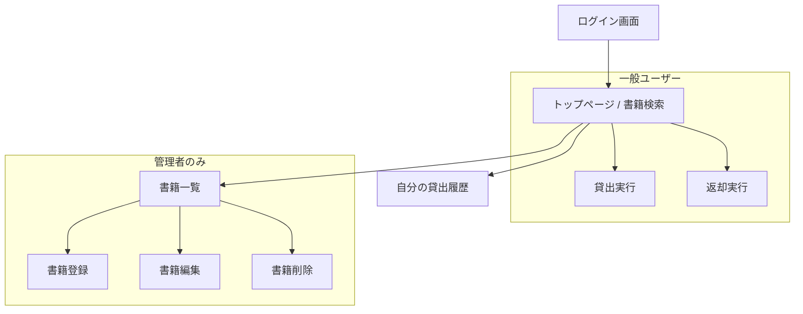

# 図書管理システム 基本仕様書

本ドキュメントは、演習用図書管理システムの機能および仕様を定義したものです。テスターは本仕様に基づき、システムの挙動が正しいか（期待値通りか）を確認してください。

## 1. システム概要
小規模な図書室での利用を想定した、ブラウザベースの図書管理システムです。ユーザーの認証、書籍の検索・管理、および貸出・返却機能を提供します。

## 2. 登場人物（ユーザーロール）
| ロール | 説明 | 可能な操作 |
|---|---|---|
| **一般ユーザー** | 本を借りる利用者 | ログイン、書籍検索、貸出中の本の一覧確認、貸出、返却 |
| **管理者** | 図書室の運営者 | 一般ユーザーの操作に加え、書籍の登録・編集・削除 |

## 3. 画面遷移図

## 4. 各画面の機能詳細

### 4.1. ログイン画面
- ユーザー名とパスワードを入力してログインする。
- **仕様:**
    - ユーザー名またはパスワードが未入力の場合はエラーを表示する。
    - 認証失敗時は「ユーザー名またはパスワードが正しくありません」と表示する。

### 4.2. 書籍検索・一覧（トップページ）
- タイトル、ISBN、著者名による曖昧検索ができる。
- **仕様:**
    - 検索条件が空の場合は全件表示する。
    - 削除済み（is_deleted=1）の書籍は表示されない。

### 4.3. 書籍登録・編集（管理者専用）
- 新しい書籍の追加および既存書籍の情報変更を行う。
- **バリデーション仕様:**
    - **タイトル:** 必須。
    - **ISBN:** 必須（形式チェックは簡易的な文字数のみ）。
    - **在庫数:** 0以上の整数のみ。

### 4.4. 貸出機能
- 在庫がある書籍を借りる。
- **仕様:**
    - **貸出上限:** 1ユーザーにつき、**同時に5冊まで**。
    - **在庫チェック:** 在庫数が0の書籍は借りることができない（ボタンが無効化またはエラー）。
    - **返却期限:** 貸出日から**14日後**。
    - **週末延長:** 返却期限が土日の場合は、翌週の**月曜日**に自動的に延長される。

### 4.5. 返却機能
- 自分が借りている書籍を返却する。
- **仕様:**
    - 返却完了後、書籍の在庫数が1増加する。
    - 既に返却済みのレコードに対して再度返却を行うことはできない。

### 4.6. 書籍削除（管理者専用）
- 書籍マスタからデータを削除する。
- **仕様:**
    - **データ整合性:** その書籍が**貸出中（未返却）の場合、削除はできない**。
    - **論理削除:** 履歴保存のため、データは物理削除せず「削除フラグ」を立てる。

## 5. 共通仕様・エラー
- 未ログイン状態で各機能（/books, /loans 等）へアクセスしようとした場合、ログイン画面へリダイレクトされる。
- 権限のないページ（一般ユーザーが/books/create等）へアクセスした場合は、403 Forbidden エラーとなる。
